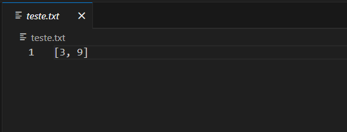

# Sistema de gerenciamento de médias

O sistema de de gerenciamento de médias foi desenvolvido puramente em PHP com auxílio de arquivo de extensão .txt.

### Executando a aplicação
Abra o terminal do windows e digite o seguinte comando:
php -S localhost:9000

### Arquivo .txt
O arquivo teste.txt é o auxiliar desta aplicação, pois nele contêm um array de números inteiros na qual é possível acrescentar ou 
retirar qualquer número.
